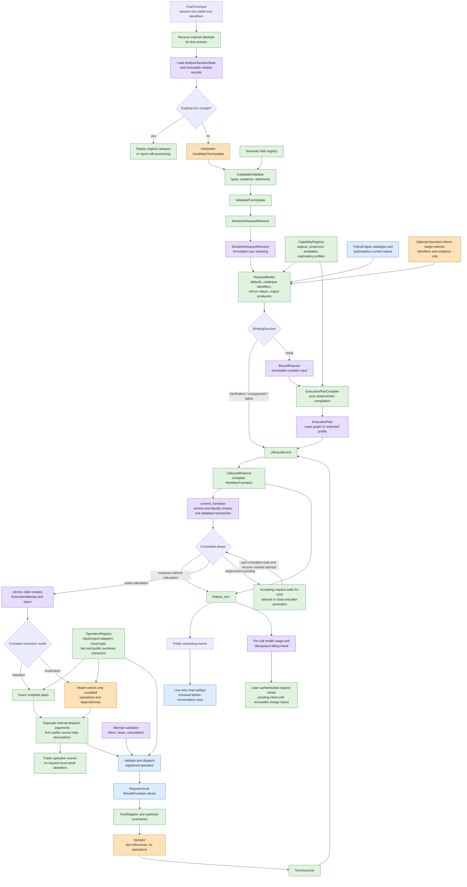
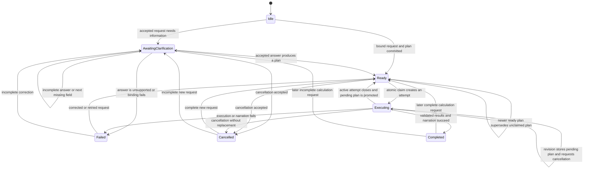

# Stateful Policy Analysis Compiler

UK Chat processes every user message through the same typed sequence. A model
may propose what the user means, but server code validates the proposal,
maintains semantic request history, resolves authoritative inputs, compiles
calculation instructions, controls lifecycle changes, and validates actual
operation results.

## Directional architecture

Each arrow is an ownership boundary. A later component may reject its input,
but it does not modify a record owned by an earlier component.

## Distinct state and instruction types

`SemanticRequestRevision` records normalized user meaning, cited evidence,
relationship to an earlier request, inherited or cleared fields, requested
outputs, and invalidation metadata. It excludes server defaults, catalogue
identifiers, runtime versions, and calculation operations. A model can author a
reform intent and typed instruction, but not the normalized `reform` value that
the binder derives from authoritative catalogue data.

`BoundRequest` links to one semantic revision and records compiler-ready values:
server defaults with provenance, authoritative catalogue identifiers, validated
reform values, resolved output producers, and runtime versions. Binding creates
a new immutable record and never overwrites the semantic revision.

`ExecutionPlan` is a compiler-owned instruction document. A standard plan
contains exact operations, arguments, result types, and dependency edges. An
exploratory plan contains the smallest server-defined operation profile that
can produce the requested outputs, plus fixed arguments and resource limits.

`AnalysisSessionState` contains only lifecycle phase, ordering version, and
active or pending record identifiers. It does not contain operation graphs or
calculation values. `ExecutionAttempt` separately records which worker may run
one plan, using a stored token hash and a time-limited lease.

## Reducer and compiler responsibilities

| Component | Input | Output | Exclusive responsibility |
| --- | --- | --- | --- |
| `SemanticRequestReducer` | `ValidatedTurnUpdate`, current semantic records | `SemanticRequestRevision` | Start, revise, inherit, clear, relate, and apply a validated clarification answer |
| `RequestBinder` | semantic revision, capability registry, authoritative catalogue | `Ready`, `NeedsClarification`, `Unsupported`, or `BindingFailed` | Apply defaults, resolve identifiers, calculate typed reforms, and prove every output has complete inputs |
| `ExecutionPlanCompiler` | `BoundRequest`, capability registry | `ExecutionPlan` | Produce deterministic operation instructions and authority limits |
| `LifecycleReducer` | `AnalysisSessionState`, typed lifecycle event | `WorkflowTransition` | Construct the complete next session state and all related record/status changes |
| `AnalysisStateStore` | `WorkflowTransition` | committed state or typed conflict | Check versions and parent identities and commit the transition atomically |

The term “workflow” refers to the overall processing sequence. In code, use the
specific `AnalysisSessionState` or `WorkflowTransition` type instead of treating
the workflow as another mutable planning object.

## Lifecycle behavior

Conversation `state_version` orders accepted state changes. It is not execution
authority. The raw execution token authorizes one durable attempt and remains
valid across unrelated conversation-version changes. A revision during
execution stores at most one pending plan; that plan cannot be claimed until
the active attempt has reached a final status. The request that accepted that
replacement remains open, waits for promotion, and then claims and executes the
replacement; recording a pending plan is not itself a successful response.

## Result and narration boundary

Every operation return value is validated by its registered Pydantic adapter.
Only then can it create a `ResultEnvelope`, satisfy a required result type, or
feed a registered fact/public-summary extractor. Dependency resolution accepts
only completed results from an explicitly permitted prior step in the same
execution.

Complete calculation values and request-local result identifiers live in the
in-memory `TurnResultStore`. They are released after the request and never
enter analysis state, plans, attempts, receipts, usage rows, billing rows,
traces, diagnostics, or conversation records. Narration receives sanitized
summaries and a `FactRegister`; it has no calculation operation definitions.

Internal dispatch arguments and public operation-event arguments are built
separately. Dependency resolution may add a request-local identifier only to
the internal dispatch object; the public event describes the producing step.
A chart is sent as a typed artifact only on the live completed event. Before
conversation persistence or title generation, the frontend replaces its chart
block with a fixed explanatory placeholder.

## Persistence and finalization

`LifecycleReducer` constructs every next `AnalysisSessionState`.
`AnalysisStateStore.commit_transition` then validates state version, session
identity, parent-child links, active-attempt uniqueness, and every conditional
status update. All appended records, status updates, session state, receipt,
usage, and billing-intent writes roll back together on a mismatch.

Narration completes before a successful attempt and receipt are finalized.
`finalize_turn` checks that the typed outcome agrees with the next lifecycle
phase, stores sanitized category-aware replay metadata, and derives public
events. Duplicate processing returns a still-processing response without model
or calculation calls. Finalized duplicates preserve the original category and
do not submit billing again. A processing receipt older than the request timeout
and a reused turn identifier with different content produce typed conflicts
before model work. Recovery compares the exact lease it observed, so a racing
worker heartbeat prevents an incorrect expiry. Billing intents store the user
and immutable charge inputs required for a later idempotent retry.

Operational values and extension procedures are maintained in
`docs/engineering/skills/uk-chat-runtime.md`.
