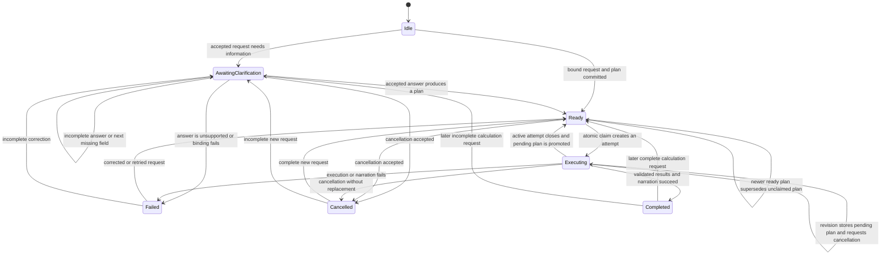

# Stateful Policy Analysis Compiler

UK Chat processes every user message through the same typed sequence. A model
may propose what the user means, but server code validates the proposal,
maintains semantic request history, resolves authoritative inputs, compiles
calculation instructions, controls lifecycle changes, and validates actual
operation results.

## Implementation status

The compiler, lifecycle, execution, finalization, projection, billing, and SQL
storage boundaries described below are implemented. The application-service
simplification is still in progress:

- The typed `TurnInterpreter` dependency is implemented by `interpret_turn`,
  which parses and validates the model-authored candidate before routing.
- `RequestCompiler` is the normal entry point for semantic reduction,
  authoritative binding, and plan compilation.
- `ExecutionEngine` is the normal entry point for standard or exploratory plan
  execution.
- `AnalysisStore` is the persistence protocol and `SqlAnalysisStore` is its SQL
  implementation. `AnalysisStateStore` remains as a temporary compatibility
  alias.
- `finalize_turn` returns `FinalizationResult`; `ChatEventProjector` separately
  creates public streaming events, and billing adapters separately create and
  process immutable billing intents.
- `run_analysis_turn` in `backend/analysis/coordinator.py` still sequences the
  complete turn and is the one temporary analysis module that imports chat
  types. It has not yet been replaced by `AnalysisTurnService`.

The remaining design work is to narrow the SQL store methods, introduce
`AnalysisTurnService`, reduce `run_analysis_turn` to a chat-side compatibility
adapter, expand the corresponding invariant and evaluation coverage, and then
remove temporary aliases and direct strategy entry points. The OpenSpec task
list is the authoritative completion record for that work.

## Directional architecture

```mermaid
flowchart TB
    classDef model fill:#fde2b8,stroke:#b26a00,color:#222
    classDef deterministic fill:#dff3df,stroke:#2e7d32,color:#222
    classDef persisted fill:#e8ddff,stroke:#7455b8,color:#222
    classDef execution fill:#dcecff,stroke:#2867a8,color:#222

    classDef transitional fill:#fff2cc,stroke:#b8860b,color:#222,stroke-width:2px
    classDef adapter fill:#f2e6ff,stroke:#7455b8,color:#222

    Chat["Chat adapter<br/>run_chat_turn"]:::adapter
    Chat --> Coordinator["run_analysis_turn<br/>current application coordinator"]:::transitional
    Coordinator --> Recover["Recover expired attempts<br/>for this session"]:::deterministic
    Recover --> Load["AnalysisStore<br/>load AnalysisSessionState and records"]:::persisted
    Load --> Receipt{"Existing turn receipt?"}
    Receipt -->|yes| Replay["Replay original category<br/>or report still processing"]:::deterministic
    Receipt -->|no| Interpret["interpret_turn<br/>model candidate and validation"]:::model

    Interpret --> Validate["CandidateValidator<br/>types, evidence, references"]:::deterministic
    Fields["Semantic field registry"]:::deterministic --> Validate
    Validate --> Update["ValidatedTurnUpdate"]:::deterministic
    Update --> Request["RequestCompiler<br/>one compilation decision"]:::deterministic
    Capabilities["CapabilityRegistry and<br/>operation catalogue"]:::deterministic --> Request
    Catalogue["PolicyEngine catalogue and<br/>authoritative current values"]:::execution --> Request
    Selector["Optional bounded reform-target selector<br/>identifiers and evidence only"]:::model --> Request

    subgraph CompilerCore["RequestCompiler internals"]
        Semantic["SemanticRequestReducer"]:::deterministic
        Revision["SemanticRequestRevision"]:::persisted
        Bind["RequestBinder"]:::deterministic
        Bound["BoundRequest"]:::persisted
        Compile["ExecutionPlanCompiler"]:::deterministic
        Plan["ExecutionPlan"]:::persisted
        Semantic --> Revision --> Bind --> Bound --> Compile --> Plan
    end
    Request --> Semantic
    Request --> Decision{"Compilation decision"}
    Decision -->|clarification / unsupported / failed| LifecycleEvent["LifecycleEvent"]:::deterministic
    Decision -->|compiled| LifecycleEvent

    LifecycleEvent --> Lifecycle["LifecycleReducer<br/>complete WorkflowTransition"]:::deterministic
    Lifecycle --> Commit["SqlAnalysisStore<br/>commit typed transition"]:::persisted
    Commit --> State{"Committed phase"}
    State -->|response without calculation| Finalize["finalize_turn"]:::deterministic
    State -->|ready calculation| Claim["Atomic claim creates<br/>ExecutionAttempt and token"]:::persisted
    State -->|replacement pending| Wait["Accepting request waits for prior<br/>attempt to close and plan promotion"]:::deterministic
    Wait -->|poll committed state and recover expired attempt| State

    Claim --> Engine["ExecutionEngine<br/>typed progress and result"]:::deterministic
    Engine --> Mode{"Compiled execution mode"}
    Mode -->|standard| Standard["Exact compiled steps"]:::deterministic
    Mode -->|exploratory| Explore["Model selects only compiled<br/>operations and dependencies"]:::model
    Operations["Operation catalogue<br/>input/output adapters, dispatch,<br/>facts and public summaries"]:::deterministic --> Standard
    Operations --> Explore
    Standard --> Arguments["Shared operation path<br/>internal dispatch and public projection"]:::deterministic
    Explore --> Arguments
    Arguments --> OperationEvents["Typed operation progress<br/>no request-local result identifiers"]:::deterministic
    Arguments --> Dispatch["Validate and dispatch<br/>registered operation"]:::execution
    Operations --> Dispatch
    Watch["Attempt validation<br/>token, lease, cancellation"]:::persisted --> Dispatch
    Dispatch --> Results["Request-local ResultEnvelope values"]:::execution
    Results --> Facts["FactRegister and sanitized summaries"]:::deterministic
    Facts --> Narrate["Narrator<br/>fact references, no operations"]:::model
    Narrate --> Outcome["TurnOutcome"]:::deterministic
    Outcome --> LifecycleEvent
    Lifecycle --> Finalize
    Finalize --> FinalResult["FinalizationResult"]:::deterministic
    Replay --> Project
    OperationEvents --> Project["ChatEventProjector"]:::adapter
    FinalResult --> Project
    Project --> Public["Public streaming events"]
    Public --> Artifact["Live-only chart artifact<br/>removed before conversation save"]:::execution
    FinalResult --> Usage["Persisted per-call usage and<br/>immutable billing intent"]:::persisted
    Usage --> Retry["BillingIntentProcessor<br/>idempotent external retry"]:::adapter

    Target["Target: AnalysisTurnService<br/>replaces coordinator sequencing"]:::transitional
    Target -. not implemented yet .-> Coordinator
```

Each solid arrow is an implemented ownership boundary. The yellow coordinator
is transitional: it uses the request and execution facades but still assembles
lifecycle, persistence, narration, finalization, and chat projection itself.
The dotted arrow marks the intended replacement, not production behavior.

## Distinct state and instruction types

`SemanticRequestRevision` records normalized user meaning, cited evidence,
relationship to an earlier request, inherited or cleared fields, requested
outputs, and invalidation metadata. It excludes server defaults, catalogue
identifiers, runtime versions, and calculation operations. A model can author a
reform intent and typed instruction, but not the normalized `reform` value that
the binder derives from authoritative catalogue data.

`BoundRequest` links to one semantic revision and records compiler-ready values:
server defaults with provenance, authoritative catalogue identifiers, validated
reform values, resolved output producers, and runtime versions. Binding creates
a new immutable record and never overwrites the semantic revision.

`ExecutionPlan` is a compiler-owned instruction document. A standard plan
contains exact operations, arguments, result types, and dependency edges. An
exploratory plan contains the smallest server-defined operation profile that
can produce the requested outputs, plus fixed arguments and resource limits.

`AnalysisSessionState` contains only lifecycle phase, ordering version, and
active or pending record identifiers. It does not contain operation graphs or
calculation values. `ExecutionAttempt` separately records which worker may run
one plan, using a stored token hash and a time-limited lease.

## Reducer and compiler responsibilities

| Component | Input | Output | Exclusive responsibility |
| --- | --- | --- | --- |
| `TurnInterpreter` / `interpret_turn` | loaded state and latest user message | validated update and per-call usage | Call the interpretation model, parse the candidate, validate evidence and state references, and bound retry behavior |
| `SemanticRequestReducer` | `ValidatedTurnUpdate`, current semantic records | `SemanticRequestRevision` | Start, revise, inherit, clear, relate, and apply a validated clarification answer |
| `RequestBinder` | semantic revision, capability registry, authoritative catalogue | `Ready`, `NeedsClarification`, `Unsupported`, or `BindingFailed` | Apply defaults, resolve identifiers, calculate typed reforms, and prove every output has complete inputs |
| `ExecutionPlanCompiler` | `BoundRequest`, capability registry | `ExecutionPlan` | Produce deterministic operation instructions and authority limits |
| `RequestCompiler` | validated semantic update and loaded state | compiled, clarification, unsupported, or failed decision | Invoke semantic reduction, binding, and plan compilation once for one accepted calculation update |
| `LifecycleReducer` | `AnalysisSessionState`, typed lifecycle event | `WorkflowTransition` | Construct the complete next session state and all related record/status changes |
| `AnalysisStore` / `SqlAnalysisStore` | typed load, transition, claim, attempt, recovery, and finalization inputs | typed persisted results or conflicts | Retain atomic ownership of related analysis records; some mutating methods still need typed-command cleanup |
| `ExecutionEngine` | claimed execution request | typed progress plus completed, failed, or cancelled result | Select standard or exploratory execution and use the shared operation-validation path |
| `finalize_turn` | typed outcome, transition context, usage, and optional billing intent | `FinalizationResult` | Validate and persist the final analysis result without creating chat events or calculating prices |
| `ChatEventProjector` | typed execution progress, replay outcome, or finalization result | public streaming events | Translate analysis values into the chat transport contract |

The term “workflow” refers to the overall processing sequence. In code, use the
specific `AnalysisSessionState` or `WorkflowTransition` type instead of treating
the workflow as another mutable planning object.

## Lifecycle behavior

Conversation `state_version` orders accepted state changes. It is not execution
authority. The raw execution token authorizes one durable attempt and remains
valid across unrelated conversation-version changes. A revision during
execution stores at most one pending plan; that plan cannot be claimed until
the active attempt has reached a final status. The request that accepted that
replacement remains open, waits for promotion, and then claims and executes the
replacement; recording a pending plan is not itself a successful response.

## Result and narration boundary

Every operation return value is validated by its registered Pydantic adapter.
Only then can it create a `ResultEnvelope`, satisfy a required result type, or
feed a registered fact/public-summary extractor. Dependency resolution accepts
only completed results from an explicitly permitted prior step in the same
execution.

Complete calculation values and request-local result identifiers live in the
in-memory `TurnResultStore`. They are released after the request and never
enter analysis state, plans, attempts, receipts, usage rows, billing rows,
traces, diagnostics, or conversation records. Narration receives sanitized
summaries and a `FactRegister`; it has no calculation operation definitions.

Internal dispatch arguments and public operation-event arguments are built
separately. Dependency resolution may add a request-local identifier only to
the internal dispatch object; the public event describes the producing step.
A chart is sent as a typed artifact only on the live completed event. Before
conversation persistence or title generation, the frontend replaces its chart
block with a fixed explanatory placeholder.

## Persistence and finalization

`LifecycleReducer` constructs every next `AnalysisSessionState`.
`SqlAnalysisStore.commit_transition` then validates state version, session
identity, parent-child links, active-attempt uniqueness, and every conditional
status update. All appended records, status updates, session state, receipt,
usage, and billing-intent writes roll back together on a mismatch.

Narration completes before a successful attempt and receipt are finalized.
`finalize_turn` checks that the typed outcome agrees with the next lifecycle
phase and stores sanitized category-aware replay metadata. It returns a
`FinalizationResult`; `ChatEventProjector` creates public events afterward.
Duplicate processing returns a still-processing response without model or
calculation calls. Finalized duplicates preserve the original category and do
not submit billing again. A processing receipt older than the request timeout
and a reused turn identifier with different content produce typed conflicts
before model work. Recovery compares the exact lease it observed, so a racing
worker heartbeat prevents an incorrect expiry. Billing intents store the user
and immutable charge inputs required for a later idempotent retry.

Operational values and extension procedures are maintained in
`docs/engineering/skills/uk-chat-runtime.md`.
