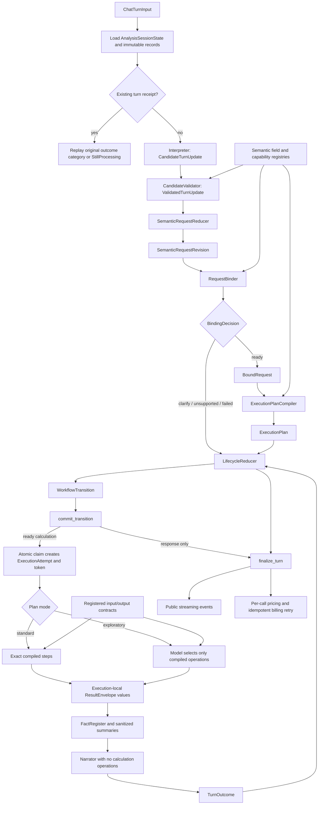

# UK Chat Runtime

Use this guidance when changing the UK chat model pathway, prompts, calculation
operations, lifecycle persistence, or numerical response boundaries.

## Component ownership

- `backend/analysis/interpreter.py` asks the model for an untrusted
  `CandidateTurnUpdate`; it does not decide whether that update is valid.
- `backend/analysis/candidate_validation.py` checks candidate types, evidence,
  semantic field legality, and references against loaded state. It produces a
  `ValidatedTurnUpdate`.
- `SemanticRequestReducer` applies only validated semantic starts, revisions,
  explicit clearing, output changes, relationships, and clarification answers.
  Its output is an immutable `SemanticRequestRevision` containing user meaning.
- `RequestBinder` applies registered defaults, resolves catalogue terms,
  computes typed reform transformations, validates requested outputs, and
  produces a separate immutable `BoundRequest`.
- `ExecutionPlanCompiler` is a pure function of `BoundRequest` and the versioned
  `CapabilityRegistry`. It emits exact standard steps or the smallest applicable
  server-owned exploratory operation profile.
- `LifecycleReducer` is the only production component that creates a next
  `AnalysisSessionState` or a `ClarificationResolution`. It converts a typed
  lifecycle event to a complete `WorkflowTransition`.
- `AnalysisStateStore.commit_transition` validates identities and conditionally
  commits the complete transition in one short database transaction.
- The executor requires a durable `ExecutionAttempt` and its raw execution
  token. It validates registered operation inputs, actual outputs, and
  execution-local result dependencies.
- `finalize_turn` validates agreement between `TurnOutcome` and lifecycle state,
  then commits the final lifecycle change, sanitized replay data, per-call usage,
  and the idempotent billing intent together. It also derives the public event
  sequence from the committed outcome.
- `backend/chat/` prepares transport input and projects typed outcomes to the
  existing public streaming-event protocol. It must not implement another
  analysis path.

Production analysis code must not import `backend/eval/`. Evaluation code may
import production boundaries.

## Directional runtime

The arrows are one-way ownership boundaries. A later component may reject an
input but must not rewrite an earlier component's accepted output.

## Session lifecycle state versus calculation instructions

`AnalysisSessionState` records the conversation-level lifecycle phase and the
identifiers of the active revision, clarification, bound request, plan,
execution attempt, and pending replacement plan. It contains no operation graph
and no calculation values.

An `ExecutionPlan` records calculation instructions: operation identifiers,
typed arguments, dependencies, expected result types, versions, limits, and the
canonical plan hash. Standard plan templates and exploratory profiles are
compiler inputs stored in the capability registry; they are not session state.

Do not use the word “workflow” without identifying which of these concrete
structures is meant.

## Candidate and semantic rules

Every user message is interpreted, including messages after the first. Do not
branch on transcript length. Transcript text is language context; loaded typed
records are authoritative for identifiers, inherited values, and lifecycle
preconditions.

The interpreter may emit only start, revise, answer-clarification,
ask-about-execution, or cancel candidates. Its schema is generated from the
semantic field registry. Operation identifiers, dependencies, runtime versions,
dataset identifiers, iteration limits, and operation-call limits are absent.

Exact scalar evidence preserves JSON types. In particular, `false`, `true`, and
numeric zero are distinct valid values. Controlled values use registered
synonyms, while structured values use their Pydantic/domain adapters. A stale
revision, clarification, or execution reference fails validation before
semantic reduction.

The model may author `reform_intent` and a typed `reform_instruction`; it may
not author the normalized `reform` field. `reform` is a server-derived field
created by binding from the instruction and authoritative catalogue data. The
candidate schema omits it, and candidate validation rejects it even if a caller
constructs a candidate without using the generated schema. Compatibility reads
may retain a previously bound `reform`, but that does not make it a candidate
field.

`SemanticRequestRevision` contains only normalized user meaning and provenance.
It never receives server defaults, catalogue identifiers, runtime versions,
readiness state, or compiled operations.

## Binding, clarifications, and reforms

`RequestBinder.bind` returns exactly one of `Ready`, `NeedsClarification`,
`Unsupported`, or `BindingFailed`. `Ready` contains a `BoundRequest`; it never
contains a modified semantic revision.

Each registered default is recorded as a distinct `RequestField` with default
provenance. Catalogue labels resolve to authoritative identifiers in the bound
request while original evidence remains in the semantic revision. Every
requested output must resolve to a compatible producer with all typed arguments
before the request is ready.

Reform meaning uses the discriminated `ReformInstruction` variants:
`set_exact`, `change_by_amount`, `change_by_percent`, `abolish`, `set_toggle`,
`named_transformation`, and `direction_only`. Amounts and percentages are
computed from authoritative current values. Abolition uses parameter-specific
inactive metadata. Direction alone requires clarification.

When target language is ambiguous, the optional model receives only bounded
authoritative targets and may return identifiers plus evidence. It cannot
return a value, magnitude, operation, runtime version, or execution limit.

Clarifications declare their target contract and whether choices are open,
advisory, or closed. An incomplete answer to the same target increments the
attempt count. A different missing target starts at zero. Answered, rejected,
unsupported, replaced, superseded, and cancelled resolutions are immutable
records created by `LifecycleReducer`; the coordinator supplies only the prior
clarification, resolving turn, and whether the turn submitted an answer.

## Capability extension procedure

When adding a semantic field:

1. Add one `SemanticFieldSpec` with its adapter, legal analysis kinds, evidence
   policy, set/clear behavior, controlled vocabulary, and clarification contract.
2. Reference it from the relevant `AnalysisCapability` definitions.
3. Add candidate validation tests for valid types, wrong types, evidence, clear
   behavior, and illegal analysis kinds.
4. Add binder and compiler consistency cases showing that the same registry
   version resolves the field.

When adding an output or producer:

1. Register an `OutputProducer` with legal analysis kinds, required fields,
   prerequisite, operation, and actual result type.
2. Add the output to the applicable capabilities and, if exploratory, to the
   smallest safe exploratory profile.
3. Register the operation input schema and its runtime input adapter, an
   allowlisted output adapter, result type, permitted dependency types, fact
   extractor, and sanitized summary builder.
4. Add registry validation, binder readiness, deterministic compiler, executor
   output-contract, dependency, public-summary, and manual evaluation cases.

Registry validation must fail for unknown fields, missing operations,
incompatible producer requirements, duplicate defaults, or an output without a
producer.

## Compilation and execution authority

Standard requests compile to an exact graph. A model cannot add, remove,
reorder, or rewrite its operations. Multi-output compilation deduplicates shared
simulation prerequisites.

Exploratory compilation selects the smallest server-owned profile capable of
producing the requested outputs. Before every exploratory dispatch, validate
the operation identifier, fixed and allowed arguments, dependency edge,
dependency result type, iteration count, and operation-call count.

Plan claim atomically creates one `ExecutionAttempt` before dispatch. Only the
token hash is stored; the raw token is returned to the claiming worker. Token
validation checks session, revision, bound request, plan identity and hash,
attempt status, and lease. Conversation `state_version` is only an ordering
check and does not authorize execution.

A revision during execution records one pending plan and changes the active
attempt to `cancellation_requested`. It cannot claim the replacement while the
old attempt is active. The request that accepted the replacement remains open,
waits for the old attempt to close, observes the lifecycle reducer promoting
the pending plan to ready, then claims and executes that plan. It does not emit
a successful response merely because the replacement was recorded. The
executor polls token, cancellation, supersession, and lease state before every
operation. A late old worker cannot change the newer active identifiers.

## Result lifetime, facts, and narration

Every registered operation return value passes its output adapter before it can
record success, create facts, or satisfy a required result. A `ResultEnvelope`
contains the execution identifier, producing step, request-local result
identifier, actual registered result type, validated value, and sanitized
summary. Dependencies can reference only successful earlier steps in the same
execution and must match the compiled dependency type.

Every operation argument object passes the runtime adapter derived from its
complete registered JSON Schema immediately before dispatch. This check enforces
required fields, exact JSON types, nested object rules, enumerations, numeric
bounds, and additional-property rules for both standard and exploratory
execution. Successful output models reject undeclared fields. The household
simulation contract permits dynamic PolicyEngine variable names only inside the
explicit `person`, `benunit`, and `household` entity containers, either directly
for a baseline calculation or beneath explicit `baseline` and `reform`
containers. It rejects undeclared top-level result fields.

Internal dispatch arguments and public operation-event arguments are separate
objects. The executor creates the public projection from the compiled step or
the model's unresolved exploratory request before resolving a dependency to a
request-local result identifier. Public dependency arguments describe the
source step, while only the internal dispatch object receives the resolved
result or simulation identifier. A defensive projection also removes such
identifiers from unexpected argument shapes.

Complete simulations, derivative payloads, chart datasets, and reusable result
identifiers live only in `TurnResultStore` for the current request. They never
enter session, plan, attempt, receipt, usage, billing, trace, diagnostic, or
conversation rows.

A generated chart is delivered as a typed `ResponseArtifact` on the live
`TurnCompleted` public event. That artifact is deliberately absent from the
receipt and duplicate replay. The frontend appends the artifact to the live
assistant response, then replaces chart blocks with a fixed explanatory
placeholder before saving the conversation or generating a title. A later
conversation load can display the narration and placeholder, but cannot recover
the original chart dataset.

Facts and public summaries are built only by the registered extractors after
output validation. The narrator receives the semantic request projection,
assumptions, sanitized summaries, caveats, fact register, and narrow approved
structural-number values. It receives only the structured narration tool and
cannot request a calculation operation. Unknown fact references or free-text
numbers fail validation; a second invalid draft uses the deterministic fact
summary.

## Finalization, replay, usage, and billing

Every response path creates a discriminated `TurnOutcome`: completed,
clarification, unsupported, failed, cancelled, conflict, or still processing.
Narration occurs before completed attempt, plan, session, and receipt state is
committed. `finalize_turn` verifies that outcome and lifecycle state agree and
commits final record changes, category-aware replay metadata, model usage, and
billing intent together, then returns the public event sequence. Conflict uses
the same function with a receipt-only `WorkflowTransition`: it persists the
conflict receipt and permitted usage without changing the current session state.
There is no separate conflict-receipt finalization method. `still_processing`
is replay-only and never enters finalization as a newly completed turn.

A duplicate processing receipt returns `still_processing` and performs no
interpretation, calculation, narration, or billing. A finalized duplicate
replays the original category and sanitized response metadata. The public
projection marks it as already processed so external billing does not run.
If a processing receipt is older than 600 seconds, a duplicate request receives
a retryable conflict instructing the client to submit a new turn identifier;
the old receipt is not treated as indefinitely active. Reusing a turn identifier
with different request content also produces a typed public conflict before
interpretation. Because that identifier belongs to the original request, this
conflict response does not overwrite its existing receipt.

Failure is a final public outcome. Its public event includes the session, turn,
model, route, outcome, stop reason, usage, cost, balance, and billing status.
Both frontend streaming paths finalize and save the assistant failure message
instead of leaving the conversation in a loading state.

Each interpreter attempt, target-selection call, exploratory iteration, and
narration attempt has a separate `ModelUsageEntry` containing its actual model
and cache token fields. Billing sums costs calculated for each entry's model.
The persisted billing intent is keyed by turn; external recording uses the same
stable turn identifier and can be retried without a second deduction. It also
stores the authenticated user and an immutable charge input for every usage
entry, including model, token counts, and the cost calculated during
finalization. Before accepting a later authenticated turn, the public service
retries that user's pending intents with these stored values and marks only a
confirmed external record as recorded. Pricing changes after finalization
therefore cannot change a retried charge.

## Persistence and operational values

Version-two storage uses `analysis_workflows`, immutable request revisions,
bound requests, clarifications and resolutions, plans, execution attempts,
turn receipts, per-call usage, and billing intents. `commit_transition` compares
the expected version, validates same-session parent relationships, requires one
affected row for every conditional update, and rolls back everything on any
mismatch. Model, PolicyEngine, and external billing calls remain outside the
transaction.

Recovery reads an expired attempt's exact status and `lease_expires_at`, then
includes both values in its conditional status update. If a worker heartbeats
after the recovery read, the changed lease prevents recovery from closing the
attempt. New requests run recovery for their own session, and a replacement
request repeats the bounded check while waiting for its pending plan to become
ready.

The authoritative runtime values are:

- execution lease: 180 seconds;
- heartbeat interval: 15 seconds;
- inactive-attempt recovery: eligible immediately after `lease_expires_at`;
- hosted request timeout: 600 seconds, which bounds a single in-process
  PolicyEngine dispatch where the underlying client has no narrower timeout;
- cancellation: cooperative between operations; and
- sanitized attempt, receipt, and per-call usage retention: the lifetime of the
  conversation, removed by conversation deletion.

Compatibility readers accept version-one workflow, plan, execution, and receipt
documents. Active writes use only version-two target models. Database migration
006 is additive for immediate application rollback and enforces at most one
claimed, running, or cancellation-requested attempt per session in PostgreSQL;
the persistence layer performs the same check for test databases.

## Required verification

Follow `testing.md` for unit, integration, API, property, migration, and
concurrency tests. Follow `ai-evals.md` for manual model evaluation fixtures.
The default automated evaluation remains offline and deterministic. Live model
and population-data cases require the repository's explicit controls.
